# VSCode Extensions being used

- Git Graph
- Live Server
- All in one Markdown
- Prettier - Code formatter
- Code Spell Checker

There is extensions.json file which will automatically suggest all the recommended extensions and give you an option of install all.
I have other extensions as well but I feel it is always a good idea to disable those extensions for a particular workspace where you are not using them.

# Some useful shortcuts

## Related to VSCode
|       Shortcuts        |       Command       |
| :--------------------: | :-----------------: |
|     Close a window     |      CTRL + W       |
|   Open the side bar    |      CTRL + B       |
|  Switch between Tabs   |     CTRL + TAB      |
|    Open Closed Tabs    |  CTRL + SHIFT + T   |
|    Split the editor    |      CTRL + \       |
|       Code Wrap        |       ALT + Z       |
|    Command Pallette    |  CTRL + SHIFT + P   |
|    Toggle terminal     |      CTRL + `       |
|          Fold          | CTRL + K , CTRL + 0 |
|         unFold         | CTRL + K , CTRL + J |
| Switch between windows |    CTRL + Number    |

## Code editing
|           Shortcuts           |                     Command                      |
| :---------------------------: | :----------------------------------------------: |
|    Move at the end a word     |                   CTRL + ->/<-                   |
|     Move line up and down     |                  ALT + UP/DOWN                   |
|    Copy a line up and down    |              SHIFT + ALT + UP/DOWN               |
|          Copy a line          |         CTRL + C (Staying in that line)          |
|        Removing a line        |         CTRL + X (Staying in that line)          |
|        Go to next line        |   CTRL + ENTER (Staying anywhere in that line)   |
|   Jump to matching brackets   |                 CTRL + SHIFT + \                 |
|            Comment            |                     CTRL + /                     |
|         Select a word         | CTRL + D (keep on pressing to select same items) |
|        Adding cursors         |                   ALT + CLICK                    |
|    Trigger parameter hints    |               CTRL + SHIFT + SPACE               |
|      Multi Cursor select      |           CTRL + SHIFT + ALT + Up/Down           |
| Escape from multi cursor mode |                       ESC                        |

## Related to extensions
|    Shortcuts     |         Command         |
| :--------------: | :---------------------: |
| Markdown Preview |       CTRL + K, V       |
|  Spell Checker   | CTRL + . (on that word) |

# Learning-HTML-CSS-JS

This repository is for learning HTML, CSS and JS basics. This will also serve as reading material learnt from tutorials. HTML is nothing but markup and all the styling is taken care by CSS. Logic part is taken care by JavaScript.

I haven't ignored .vscode since it contains my favoured vscode settings and extension recommendations for HTML which I may not use for python and hence I wanted it locally.

# Notes HTML

index.html is always the homepage of the website. To get the boiler plate code of HTML type ! and then tab.

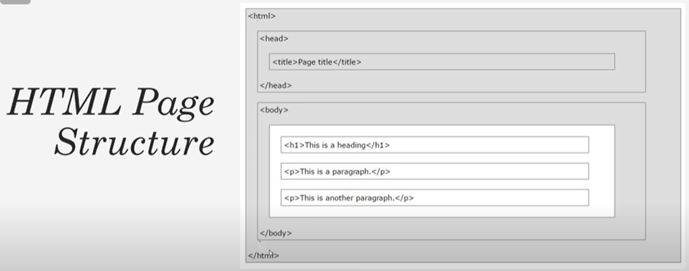
Head has nothing to do with the output that is shown in the browser. It has page title. Links to javascript and css files. Meta data such as the description and the keyword.
In the body we have the actual markup that is displayed in the webpage

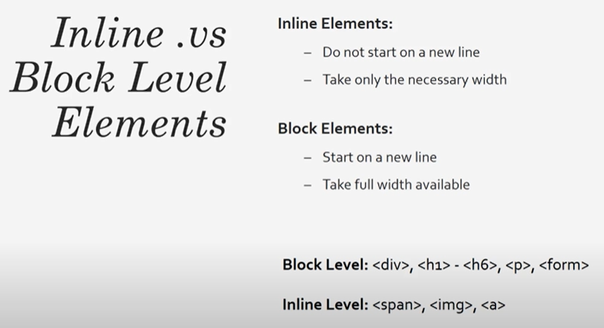
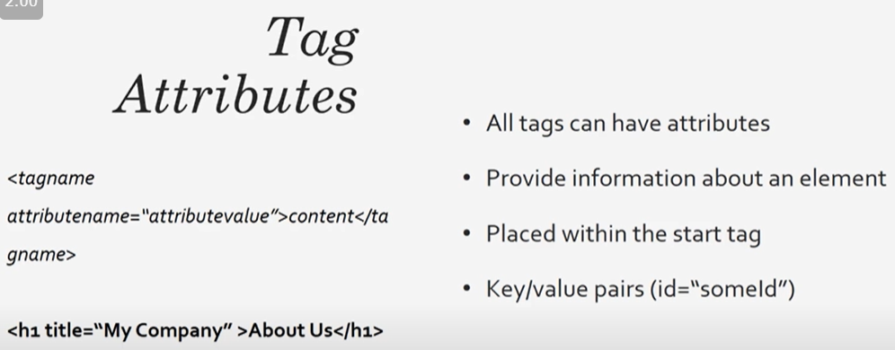
For example href provided in link is an attribute which directs it to another location.

Navigation bar that we see at the top of the website is an unordered list that has been styled

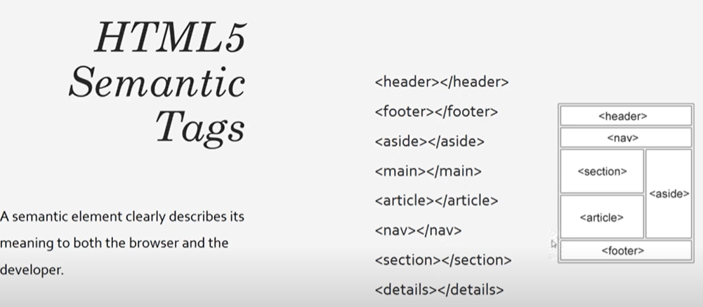
Semantic tags help in better SEO optimization of the website

[Reference](https://www.youtube.com/watch?v=UB1O30fR-EE)

# Notes CSS(Cascading Style Sheet)

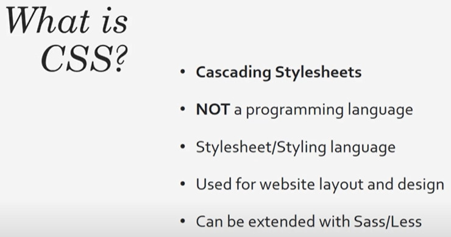
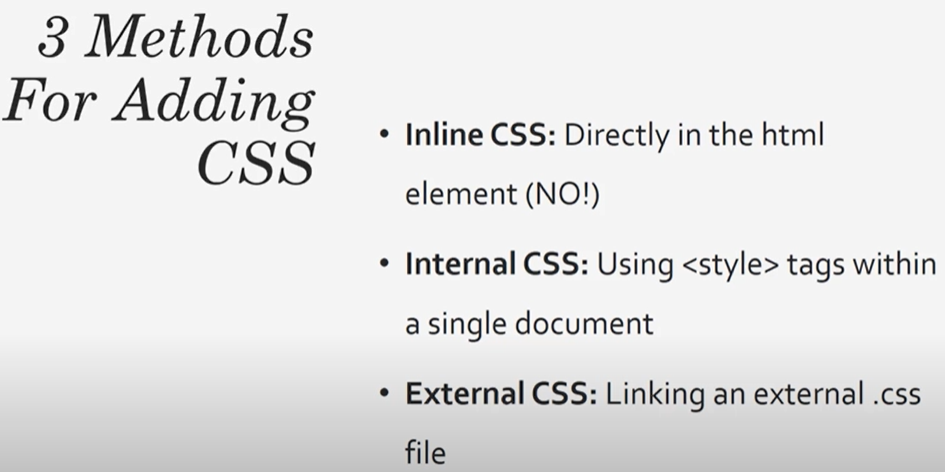
Inline CSS is a horrible way of doing something since you are mixing content with styling best way is to use external CSS.

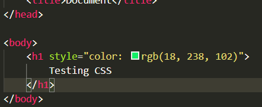

This is an example of inline css

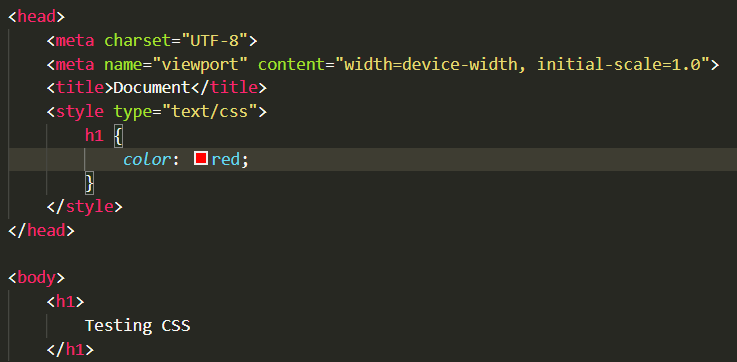

This is an example of internal css. Placing styling in head blocks.

For external css we create a folder and keep all our styling there so isn't repeated again and again for different pages and can be imported. When using external css it is best to give id's to headers and other tags. **External CSS is the best way**
Inline CSS has the highest priority followed by external and internal css. Priority between internal and external CSS is decided by which comes later.

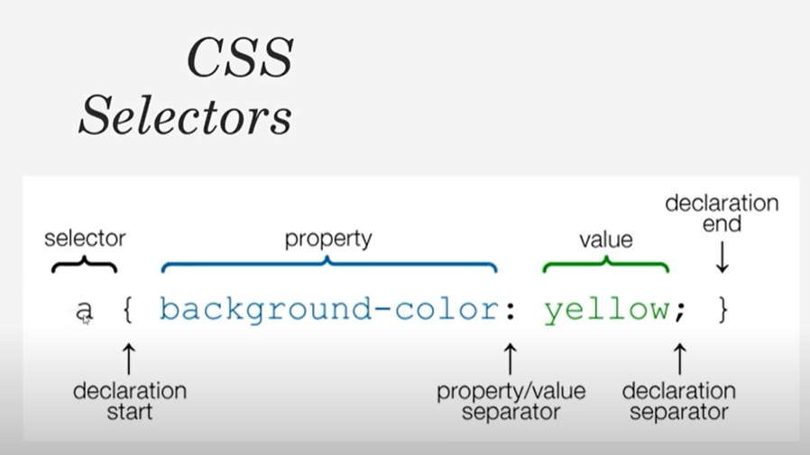
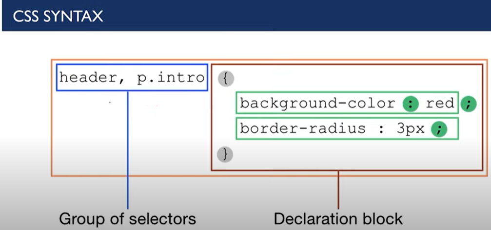

Class names need not be unique but id should be unique. Example a nav bar should have a unique id whereas a div may have same class names if you want same styling for them. It is always a best practice to make css specific to classes rather than whole body.

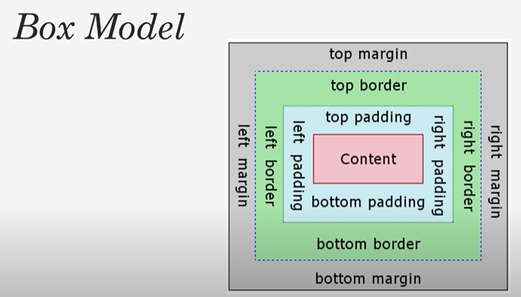

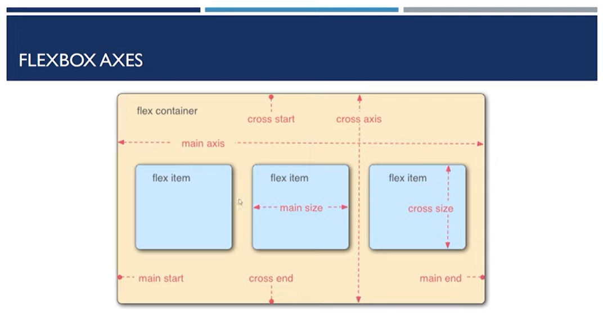

[Reference](https://www.youtube.com/watch?v=yfoY53QXEnI)

# Notes JS

Installing node [link](https://www.digitalocean.com/community/tutorials/how-to-install-node-js-on-ubuntu-18-04) on Ubuntu 18.04

