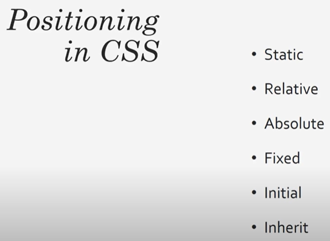

# Learning-HTML-CSS-JS
This repository is for learning HTML, CSS and JS basics. This will also serve as reading material learnt from tutorials. HTML is nothing but markup and all the styling is taken care by CSS. Logic part is taken care by JavaScript.

I haven't ignored .vscode since it contains my favoured vscode settings for HTML which I may not use for python and hence I wanted it locally.

# Notes HTML
index.html is always the homepage of the website

Head has nothing to do with the output that is shown in the browser. It has page title. Links to javascript and css files. Meta data such as the description and the keyword.
In the body we have the actual markup that is displayed in the webpage

For example href provided in link is an attribute which directs it to another location. 

Navigation bar that we see at the top of the website is an unordered list that has been styled

[Reference](https://www.youtube.com/watch?v=UB1O30fR-EE)
# Notes CSS

Inline CSS is a horrible way of doing something since you are mixing content with styling best way is to use external CSS.

This is an example of inline css

This is an example of internal css. Placing styling in head blocks.

For external css we create a folder and keep all our styling there so isn't repeated again and again for different pages and can be imported. When using external css it is best to give id's to headers and other tags.

Class names need not be unique but id should be unique. Example a nav bar should have a unique id whereas a div may have same class names if you want same styling for them. It is always a best practice to make css specific to classes rather than whole body.

[Reference](https://www.youtube.com/watch?v=yfoY53QXEnI)

# Notes JS
[Reference](https://www.youtube.com/watch?v=hdI2bqOjy3c)