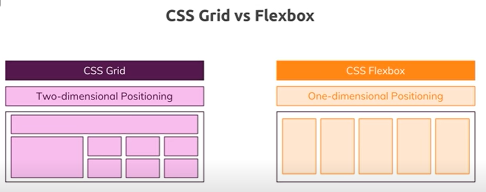
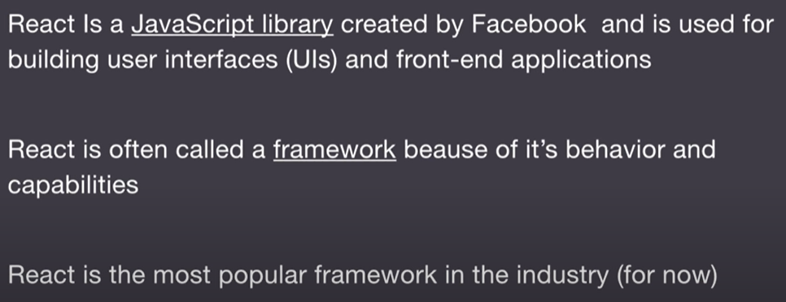
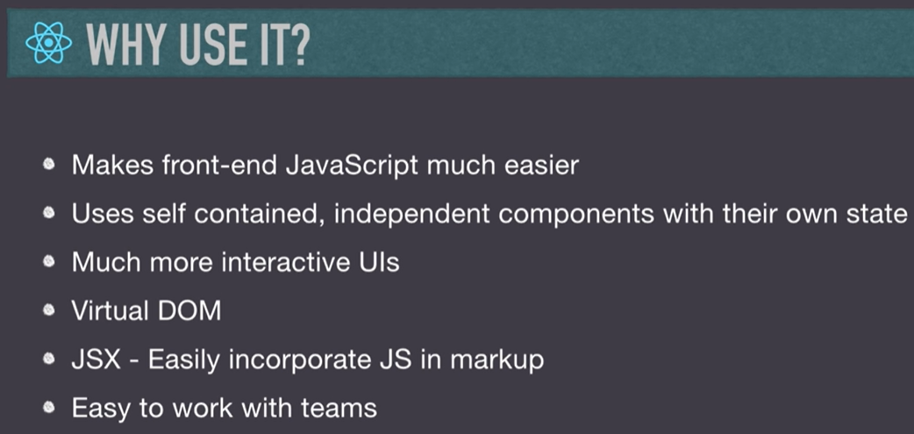

# VSCode Extensions being used

- Git Graph
- Live Server
- All in one Markdown
- Prettier - Code formatter
- Code Spell Checker
- Auto Rename Tag

There is extensions.json file which will automatically suggest all the recommended extensions and give you an option of install all.
I have other extensions as well but I feel it is always a good idea to disable those extensions for a particular workspace where you are not using them.

# Some useful shortcuts

## Related to VSCode
|       Shortcuts        |       Command       |
| :--------------------: | :-----------------: |
|     Close a window     |      CTRL + W       |
|   Open the side bar    |      CTRL + B       |
|  Switch between Tabs   |     CTRL + TAB      |
|    Open Closed Tabs    |  CTRL + SHIFT + T   |
|    Split the editor    |      CTRL + \       |
|       Code Wrap        |       ALT + Z       |
|    Command Pallette    |  CTRL + SHIFT + P   |
|    Toggle terminal     |      CTRL + `       |
|          Fold          | CTRL + K , CTRL + 0 |
|         unFold         | CTRL + K , CTRL + J |
| Switch between windows |    CTRL + Number    |

## Code editing
|           Shortcuts           |                     Command                      |
| :---------------------------: | :----------------------------------------------: |
|    Move at the end a word     |                   CTRL + ->/<-                   |
|     Move line up and down     |                  ALT + UP/DOWN                   |
|    Copy a line up and down    |              SHIFT + ALT + UP/DOWN               |
|          Copy a line          |         CTRL + C (Staying in that line)          |
|        Removing a line        |         CTRL + X (Staying in that line)          |
|        Go to next line        |   CTRL + ENTER (Staying anywhere in that line)   |
|   Jump to matching brackets   |                 CTRL + SHIFT + \                 |
|            Comment            |                     CTRL + /                     |
|         Select a word         | CTRL + D (keep on pressing to select same items) |
|        Adding cursors         |                   ALT + CLICK                    |
|    Trigger parameter hints    |               CTRL + SHIFT + SPACE               |
|      Multi Cursor select      |           CTRL + SHIFT + ALT + Up/Down           |
| Escape from multi cursor mode |                       ESC                        |

## Related to extensions
|    Shortcuts     |         Command         |
| :--------------: | :---------------------: |
| Markdown Preview |       CTRL + K, V       |
|  Spell Checker   | CTRL + . (on that word) |

# Learning-HTML-CSS-JS

This repository is for learning HTML, CSS and JS basics. This will also serve as reading material learnt from tutorials. HTML is nothing but markup and all the styling is taken care by CSS. Logic part is taken care by JavaScript.

I haven't ignored .vscode since it contains my favoured vscode settings and extension recommendations for HTML which I may not use for python and hence I wanted it locally.

# Notes HTML

index.html is always the homepage of the website. To get the boiler plate code of HTML type ! and then tab.

Head has nothing to do with the output that is shown in the browser. It has page title. Links to javascript and css files. Meta data such as the description and the keyword.
In the body we have the actual markup that is displayed in the webpage

For example href provided in link is an attribute which directs it to another location.

Navigation bar that we see at the top of the website is an unordered list that has been styled

Semantic tags help in better SEO optimization of the website

[Reference](https://www.youtube.com/watch?v=UB1O30fR-EE)

# Notes CSS(Cascading Style Sheet)

Inline CSS is a horrible way of doing something since you are mixing content with styling best way is to use external CSS.

This is an example of inline css

This is an example of internal css. Placing styling in head blocks.

For external css we create a folder and keep all our styling there so isn't repeated again and again for different pages and can be imported. When using external css it is best to give id's to headers and other tags. **External CSS is the best way**
Inline CSS has the highest priority followed by external and internal css. Priority between internal and external CSS is decided by which comes later.

Class names need not be unique but id should be unique. Example a nav bar should have a unique id whereas a div may have same class names if you want same styling for them. It is always a best practice to make css specific to classes rather than whole body.

Difference between flexbox and grid

[Video](https://www.youtube.com/watch?v=RSIclWvNTdQ) on where to use grid and where to use flexbox. In a nutshell it is easy to design websites using grid and we use flexbox for 1D elements rather than 2D. \
To create grid like structure using flexbox we use flexbox inside a flexbox.
So if you think about it flexbox and grid are the reasons why you need parent containers. Let us take the example of 1:2 design using flexbox. We create an outer container and use flexbox to divide them into 2 parts. The second divided part has its contents inside a container. We now use flexbox on this container and divide them vertically. This is a hack and it is advised to use grid. \
[Video](https://www.youtube.com/watch?v=k32voqQhODc) showing the use case of flexbox. \
[Video](https://www.youtube.com/watch?v=-GR52czEd-0) on units such as em, rem, vh and vw \
[Video](https://www.youtube.com/watch?v=Qf-wVa9y9V4) on display types (block, inline, inline-block, none, flex, grid). inline-block basically means it is inline but you can control its height and width unlike inline. \
[Video](https://www.youtube.com/watch?v=jx5jmI0UlXU) on positioning in CSS

## UI design basics
- Don't use too many colors
- Always check the contrast ratio for producing readable content
- Montserrat font or sans serif. Try to avoid times new roman. Also don't mix fonts

# General Rules for building websites
- These are not absolute rules and can be thought of as a guide
- Always write the markup of a section first and then go for styling it
- As soon as you complete a section you can go for styling
## HTML
- Set up the main div container/wrapper class in which you can have other div classes 
- A nav-bar div class will generally have ul lists for links, a logo and either a search bar or some other items. This nav-bar div can be further subdivided into different types of divs depending upon the needs.
- Once nav is done we use header tag for our hero and other stuff.
- We use section tags for the main body

## CSS
- Always set box sizing to border box for all so that padding doesn't affect width. We also set padding and margin to 0.
- We set the font family, color of text, background, font-size(by default 16px) and line height
- We then generally style some common elements like links and buttons. We make text decoration as none and give them background color and hover effects and etc. We also take away the bullets of unordered list for our nav bar by setting list-style as none.
- Then we target the main container class by defining the width and margin (generally auto so that it is evenly spaced from both sides). Generally you will give width as percentages and if the screen becomes too big then then might not look too well. So we generally set max-width in container also. 
- For the navbar we use display as flex. We also make the ul of the navbar flex. Flex 1 means it will occupy the whole horizontal space. 
- While styling the button class always add cursor so that whenever you hover over it you have a pointer. For hover it is best to change the opacity. Also declare the button as an inline element since you may change its height and width.
- Images always go out of the container unless you set their width to be 100%.
- To target something of a specific section section h3 {}
- For images we generally use url() no-repeat center center/cover
- The easiest way of centering something is using the flex box. Align and justify.
- We can use transforms translate to move items here and there.

# Notes JS

Installing node [link](https://www.digitalocean.com/community/tutorials/how-to-install-node-js-on-ubuntu-18-04) on Ubuntu 18.04

# Notes React 

