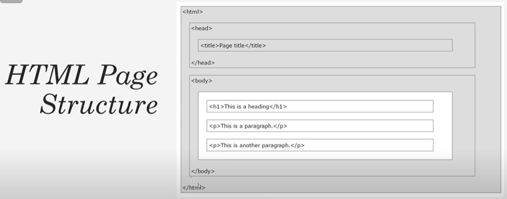

# Learning-HTML
This repository is for learning HTML. This will also serve as reading material learnt from tutorials. 
I haven't ignored .vscode since it contains my favoured vscode settings for HTML which I may not use for python and hence I wanted it locally.

# Notes
index.html is always the homepage of the website

Head has nothing to do with the output that is shown in the browser. It has page title. Links to javascript and css files. Meta data such as the description and the keyword.
In the body we have the actual markup that is displayed in the webpage